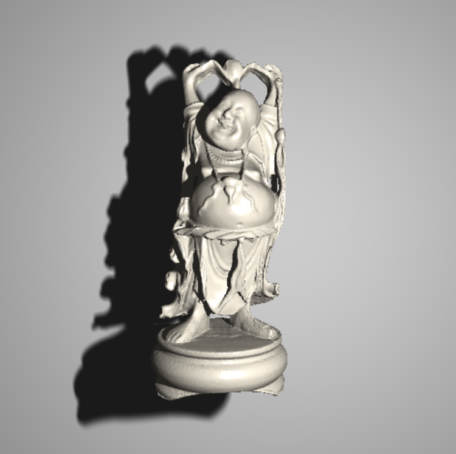

<a id="readme-top"></a>

<!-- ABOUT THE PROJECT -->
## Ray Tracer

A Java-based ray tracer built as a university dissertation project which renders 
PLY models efficiently




### Requirements

Requires Java 21

### Running the application

```powershell
.\mvnw.cmd clean javafx:run
```

<p align="right">(<a href="#readme-top">back to top</a>)</p>
